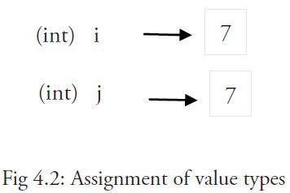
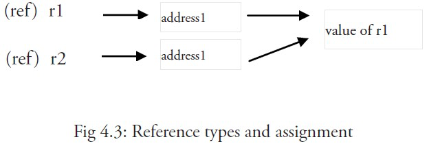

# 值类型和引用类型

程序中所用到的内存在计算机中使用一堆箱子来表示（这也是人们在讲解它的时候的画法），这些箱子被称为 “字”。根据不同的处理器以及操作系统类型，所有的字都具有 32 位（4 字节）或 64 位（8 字节）的相同长度；所有的字都使用相关的内存地址来进行表示（以十六进制数表示）。

所有像 int、float、bool 和 string 这些基本类型都属于值类型，使用这些类型的变量直接指向存在内存中的值：

另外，像数组和结构这些复合类型也是值类型

当使用等号 `=` 将一个变量的值赋值给另一个变量时，如：`j = i`，实际上是在内存中将 i 的值进行了拷贝：

你可以通过 &i 来获取变量 i 的内存地址，例如：0xf840000040（每次的地址都可能不一样）。值类型的变量值存储在栈中。

内存地址会根据机器的不同而有所不同，甚至相同的程序在不同的机器上执行后也会有不同的内存地址。因为每台机器可能有不同的存储器布局，并且位置分配也可能不同。

更复杂的数据通常会需要使用多个字，这些数据一般使用引用类型保存。

一个引用类型的变量 r1 存储的是 r1 的值所在的内存地址（数字），或内存地址中第一个字所在的位置。

这个内存地址被称之为指针，这个指针实际上也被存在另外的某一个字中。

同一个引用类型的指针指向的多个字可以是在连续的内存地址中（内存布局是连续的），这也是计算效率最高的一种存储形式；也可以将这些字分散存放在内存中，每个字都指示了下一个字所在的内存地址。

当使用赋值语句 r2 = r1 时，只有引用（地址）被复制。

如果 r1 的值被改变了，那么这个值的所有引用都会指向被修改后的内容，在这个例子中，r2 也会受到影响。

在 Go 语言中，指针 属于引用类型，其它的引用类型还包括 slices，maps 和 channel 。被引用的变量会存储在堆中，以便进行垃圾回收，且比栈拥有更大的内存空间。

